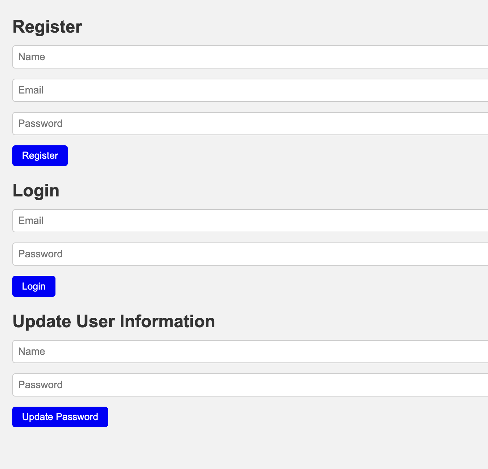
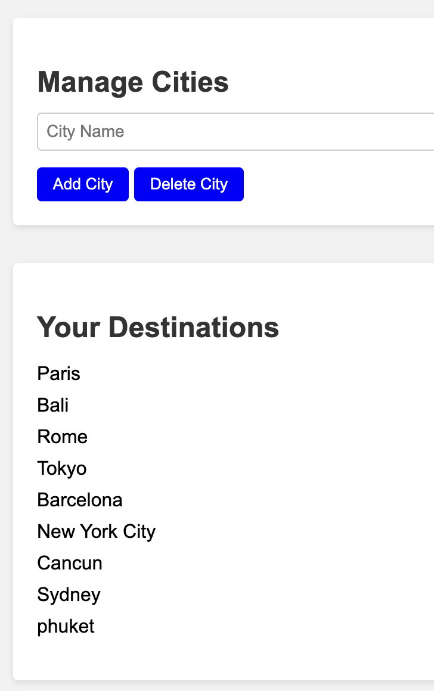

TravelApp - Your Personal Travel Planner

Technologies Used:
Javascript
Node.js
Express.js
MongoDB
HTML/CSS for basic layout

Screenshots:

☐ Getting Started:
You can access the deployed version of TravelApp here.

☐ To get started with TravelApp, follow these steps:

Register a new account by clicking on the Register button on the homepage.
https://unique-figolla-fb8e99.netlify.app/
Once registered, you can log in by clicking on the Login button and entering your credentials.
If you'd like, you can update your password in the Update Password input field.
After logging in, you can add your travel destinations, view them, and update your password through the user dashboard.
Please make sure to remember your credentials as you will need them to access your saved destinations.

☐ Planned future enhancements include:

Share Destinations: We plan to add functionality for users to share their travel destinations with others.
Travel Suggestions: A feature to provide travel suggestions based on user preferences, possibly with an AI chatbot.
Integration with Travel APIs: We're looking into integrating with various travel APIs to provide real-time data, such as weather and best travel times.
Enhanced UI/UX: We're always working to improve our user interface and user experience. Keep an eye out for more intuitive design updates!

This is my API documentation:
https://opentripmap.io/docs

☐ User Routes

☐ Register User
URL: /users/register
Method: POST
Description: Register a new user.
Controller Method: registerUser

☐ Login User
URL: /users/login
Method: POST
Description: Login an existing user.
Controller Method: loginUser

☐ Update Password
URL: /users/:name/updatePassword
Method: PUT
Description: Update the password of a user.
Controller Method: updatePassword

☐ Get User
URL: /users/:name
Method: GET
Description: Get user information by name.
Controller Method: getUser

☐ Update Name
URL: /users/:name/updateName
Method: PUT
Description: Update the name of a user.
Controller Method: updateName

☐ Update Email
URL: /users/:name/updateEmail
Method: PUT
Description: Update the email of a user.
Controller Method: updateEmail

☐ Check Password
URL: /users/:name/checkPassword
Method: POST
Description: Check if the provided password is correct for a user.
Controller Method: checkPassword

☐ Add Destination
URL: /users/addDestination
Method: POST
Description: Add a destination to a user.
Controller Method: addDestination

☐ Delete Destination
URL: /users/deleteDestination/:destinationId
Method: DELETE
Description: Delete a destination from a user by destination ID.
Controller Method: deleteDestination

☐ Destination Routes

☐ Get Destinations
URL: /destinations/:name
Method: GET
Description: Get all destinations for a user by name.
Controller Method: getDestinations

☐ Add Destination
URL: /destinations/:name
Method: POST
Description: Add a destination for a user by name.
Controller Method: addDestination

☐ Update Destination
URL: /destinations/:name/:destinationId
Method: PUT
Description: Update a destination for a user by name and destination ID.
Controller Method: updateDestination

☐ Delete Destination
URL: /destinations/:name/:destinationId
Method: DELETE
Description: Delete a destination from a user by name and destination ID.
Controller Method: deleteDestination

☐ Get Destination Details
URL: /destinations/id/:destinationId
Method: GET
Description: Get details of a destination by destination ID.
Controller Method: getDestinationDetails

User Model:
const UserSchema = new Schema({
    
  name: { 
    type: String,
    required: true
  },

  email: {
    type: String,
    required: true,
    unique: true
  },

  password: {
    type: String,
    required: true
  },

  destinations: [{
    type: Schema.Types.ObjectId,
    ref: 'Destination',
    required: false
  }],
});

Destination Model:
const DestinationSchema = new Schema({

  city: {
    type: String,
    required: true
  },

  country: {
    type: String,
    required: false
  },

  lon: {
    type: Number,
    required: false
  },

  lat: {
    type: Number,
    required: false
  },

  attractions: [{
    type: String
  }]
});